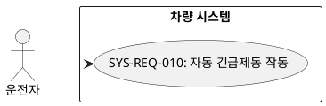
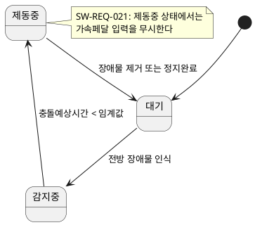
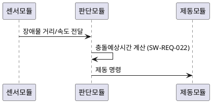
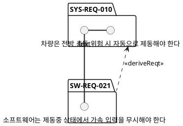

# 기능 요구사항의 UML/SysML 다이어그램화 가이드

기능 요구사항은 문장만으로는 행위·구조·상태 전이가 모호해지기 쉽다. 요구사항의 성격에 따라 아래 기준으로 다이어그램 종류를 선택하고, 다이어그램은 PlantUML 코드 블록으로 작성해 요구사항 문서에 함께 포함한다.

## 다이어그램 선택 기준

| 요구사항의 성격 | 권장 다이어그램 | 용도 |
|---|---|---|
| 사용자/외부 시스템과의 상호작용 범위를 정의 | 유스케이스 다이어그램 | 액터와 시스템 경계, 상호작용 단위 파악 |
| 처리 절차, 조건 분기, 병렬 흐름 | 액티비티 다이어그램 | 알고리즘/워크플로우 표현 |
| 모드·상태에 따라 동작이 달라짐 | 상태기계 다이어그램 | 상태, 전이 조건, 이벤트 표현 |
| 컴포넌트 간 메시지 교환 순서 | 시퀀스 다이어그램 | 시간 순서에 따른 상호작용 표현 |
| 구조적 분해(요소/포트/인터페이스) | SysML 블록 정의 다이어그램(BDD), 내부 블록 다이어그램(IBD) | 시스템 구성요소와 연결관계 표현 |
| 요구사항 간 관계(파생/충족/검증) | SysML 요구사항 다이어그램 | 요구사항 추적성을 시각적으로 표현 |

하나의 요구사항에 여러 다이어그램이 필요하면 모두 포함해도 된다. 다이어그램은 항상 요구사항 ID를 제목이나 캡션에 명시해 상호 참조가 가능하게 한다.

## PlantUML 예시

### 유스케이스 다이어그램

### 상태기계 다이어그램

### 시퀀스 다이어그램

### SysML 요구사항 다이어그램(요구사항 추적성)

## 적용 원칙

- 다이어그램은 요구사항 문장을 대체하지 않는다. 텍스트 요구사항 + 다이어그램을 함께 제시한다.
- 다이어그램에 등장하는 요소명은 요구사항 문장에 쓰인 용어와 반드시 일치시킨다(용어 불일치는 일관성 위반).
- 다이어그램만으로 검증 기준을 대신하지 않는다. 검증방안은 별도로 3단계(ISO 25010/실행 가능한 검증방안) 기준을 따른다.
