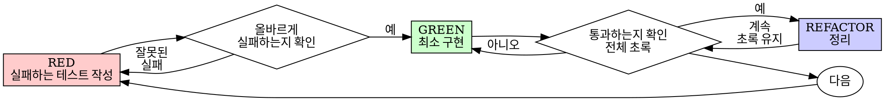

# TDD(테스트 주도 개발) — Python unittest

> 이 스킬은 [obra/superpowers의 test-driven-development 스킬](https://github.com/obra/superpowers/blob/main/skills/test-driven-development/SKILL.md)을 한국어로 옮기고, Python 3.14/`unittest` 환경과 이 프로젝트의 A-SPICE 상세설계 기반 개발 흐름에 맞게 재구성한 것이다.

## 개요

테스트를 먼저 작성한다. 실패하는 것을 확인한다. 통과시키는 최소한의 코드를 작성한다.

**핵심 원칙**: 테스트가 실패하는 모습을 직접 보지 않았다면, 그 테스트가 올바른 것을 검증하는지 알 수 없다.

**규칙의 문구를 어기는 것은 규칙의 취지를 어기는 것과 같다.**

## 언제 사용하는가

**항상 사용**: 새 기능, 버그 수정, 리팩터링, 동작 변경.

**예외(사용자에게 먼저 확인)**: 버릴 프로토타입, 생성된 코드, 설정 파일.

"이번만 TDD를 건너뛰자"는 생각이 든다면 멈춘다. 그건 정당화이지 판단이 아니다.

## 철칙

```
실패하는 테스트 없이는 프로덕션 코드를 작성하지 않는다
```

테스트보다 먼저 코드를 작성했다면 그 코드를 삭제하고 처음부터 다시 시작한다.

**예외 없음**: "참고용"으로 남겨두지 않는다. 테스트를 작성하면서 그 코드를 "적용"하지 않는다. 쳐다보지 않는다. 삭제는 삭제다. 테스트로부터 새로 구현한다.

## 0단계 — 설계 산출물에서 테스트 대상과 기법 도출

코드를 작성하기 전에, 상세설계서(`detailed-designer` 스킬의 산출물)에서 테스트 케이스와 각 케이스가 사용할 **시험 기법**을 함께 도출한다. 도출한 목록은 테스트 코드를 작성하기 전에 사용자에게 먼저 요약해 보여준다.

| 상세설계서의 근거 | 도출되는 테스트 케이스 | 시험 기법 | 긍정/부정 |
|---|---|---|---|
| 함수 계약의 사전조건/사후조건 | 정상 입력이 계약대로 동작하는지 | 사전조건/사후조건검증 | 긍정 |
| 함수 계약의 사전조건 위반, 예외/오류 처리 | 잘못된 입력에 대해 정의된 오류로 반응하는지 | 오류추정/예외처리검증 | 부정 |
| 핵심 알고리즘의 경계값(최소/최대/0/음수 등) | 경계값에서의 동작 | 경계값분석 | 경계값 성격에 따라 긍정 또는 부정 |
| 핵심 알고리즘의 입력 범위 구간 | 구간을 대표하는 값들의 동작 | 동등분할 | 긍정 |
| 정책 의사결정표의 각 행 | 조건 조합별 기대 동작 | 의사결정표기반 | 긍정(정의된 행) / 부정(정의되지 않은 조합) |
| 상태전이표의 각 전이 | 상태·이벤트·가드 조합에 따른 전이 | 상태전이기반 | 정의된 전이는 긍정, 금지된 전이 시도는 부정 |
| 버그 리포트 | 버그를 재현하고 고정하는 회귀 테스트 | 회귀테스트 | 부정(버그였던 동작 재발 방지) |

이 표에서 도출한 "기법"과 "긍정/부정"은 1단계 이후 작성하는 모든 테스트 함수의 Doxygen 주석에 그대로 반영한다(아래 "테스트 함수 주석 규칙" 참고).

## Red-Green-Refactor



### RED — 실패하는 테스트 작성

무엇이 일어나야 하는지 보여주는 최소한의 테스트 하나를 작성한다.

<Good>
```python
def test_retriesFailedOperationThreeTimes(self):
    """!
    @brief 실패하는 작업이 3회까지 재시도되어 결국 성공값을 반환하는지 검증한다.
    @technique 동등분할 (성공 전까지의 실패 횟수 구간)
    @case 긍정(Positive) - 정상 재시도 흐름
    """
    attempts = {"count": 0}

    def operation():
        attempts["count"] += 1
        if attempts["count"] < 3:
            raise RuntimeError("fail")
        return "success"

    result = retryOperation(operation)

    self.assertEqual(result, "success")
    self.assertEqual(attempts["count"], 3)
```
이름이 명확하고, 실제 동작을 검증하며, 한 가지만 다룬다.
</Good>

<Bad>
```python
def test_retryWorks(self):
    mockOperation = Mock(side_effect=[RuntimeError(), RuntimeError(), "success"])
    retryOperation(mockOperation)
    self.assertEqual(mockOperation.call_count, 3)
```
이름이 모호하고, 코드가 아니라 모의객체(mock)를 검증한다.
</Bad>

**요구사항**: 하나의 행동만 검증, 명확한 이름, 실제 코드로 검증(불가피한 경우가 아니면 모의객체 사용 금지).

### 올바르게 실패하는지 확인(RED 검증) — 필수, 절대 건너뛰지 않음

```bash
python -m unittest path.to.test_module.TestClass.test_method -v
```

확인할 것: 테스트가 실패하는가(에러가 아니라 실패인가), 실패 메시지가 예상과 같은가, 기능이 없어서 실패하는가(오타 때문이 아닌가).

**테스트가 통과한다면?** 이미 존재하는 동작을 검증하고 있는 것이다. 테스트를 고친다.
**테스트가 에러(오류)를 낸다면?** 오류를 고치고, 올바르게 실패할 때까지 다시 실행한다.

### GREEN — 최소 구현

테스트를 통과시키는 가장 단순한 코드를 작성한다. 테스트에서 요구하지 않은 기능을 미리 추가하거나, 다른 코드를 리팩터링하거나, "개선"하지 않는다.

### 통과하는지 확인(GREEN 검증) — 필수

```bash
python -m unittest discover -v
```

확인할 것: 새 테스트가 통과하는가, 기존 테스트도 모두 통과하는가, 출력이 깨끗한가(오류/경고 없음).

**테스트가 실패한다면?** 코드를 고친다(테스트를 고치지 않는다).
**다른 테스트가 깨진다면?** 지금 바로 고친다.

### REFACTOR — 정리

테스트가 모두 통과하는 상태에서만 진행한다: 중복 제거, 이름 개선, 헬퍼 추출. 테스트를 계속 초록 상태로 유지하고, 새 동작을 추가하지 않는다. 리팩터링 후에는 `coding` 스킬의 품질지표(함수 라인수/순환복잡도/중복/주석비율/네이밍)를 반드시 재확인한다.

### 반복

다음 실패하는 테스트로 넘어간다. 상세설계서에 정의된 모든 함수 계약·의사결정표 행·상태전이가 테스트로 커버될 때까지 0단계부터 반복한다.

## 좋은 테스트

| 기준 | 좋음 | 나쁨 |
|---|---|---|
| **최소성** | 한 가지만 검증. 이름에 "그리고"가 들어가면 나눈다. | `test_validatesEmailAndDomainAndWhitespace` |
| **명확성** | 이름이 동작을 설명한다 | `test1` |
| **의도 표현** | 원하는 API를 보여준다 | 코드가 무엇을 해야 하는지 감춘다 |

테스트를 작성하거나 수정할 때는 `references/writing-good-tests.md`를 함께 읽고 아래 원칙을 지킨다: 어떤 프로덕션 코드 변경이 이 테스트를 실패하게 만드는지 미리 이름 붙이기, 모의객체의 동작이 아니라 실제 동작을 검증하기, 테스트 전용 코드는 테스트 유틸리티에만 두기, 모의객체로 대체하기 전에 그 의존성의 부작용을 먼저 이해하기.

## 테스트 함수 주석 규칙 (필수)

모든 테스트 함수는 Doxygen 형식의 문서화 문자열로 아래 세 항목을 반드시 포함한다.

```python
def test_negativeDistanceRaisesValueError(self):
    """!
    @brief distanceM이 음수이면 ValueError가 발생하는지 검증한다.
    @technique 경계값분석 (거리의 하한 경계인 0 미만)
    @case 부정(Negative) - 함수 계약의 사전조건 위반 입력
    """
    ...
```

- `@brief`: 이 테스트의 목적(무엇을 검증하려는 테스트인지)을 한 문장으로 작성한다.
- `@technique`: 0단계에서 도출한 시험 기법 중 해당하는 것을 명시한다(경계값분석/동등분할/의사결정표기반/상태전이기반/오류추정·예외처리검증/사전조건·사후조건검증/회귀테스트). 여러 기법이 섞여 있으면 모두 나열한다.
- `@case`: 긍정(Positive, 정상 흐름 검증) 또는 부정(Negative, 예외·오류·경계위반 등 비정상 상황 검증) 중 하나를 명시한다.

이 규칙은 `coding` 스킬의 네이밍/Doxygen 주석 규칙(프로덕션 코드용)과 별개로, 테스트 코드에도 동일하게 강제된다. `@technique`/`@case`가 없는 테스트 함수는 완료된 것으로 보지 않는다.

## 흔한 정당화와 실제

| 변명 | 실제 |
|---|---|
| "너무 간단해서 테스트할 필요 없다" | 간단한 코드도 깨진다. 테스트는 30초면 된다. |
| "나중에 테스트하겠다" | 나중에 작성한 테스트는 바로 통과해버려 아무것도 증명하지 못한다. 잘못된 것을 검증하거나, 동작이 아니라 구현을 검증하거나, 잊어버린 경계 조건을 놓칠 수 있다. 실패를 직접 본 적이 없으므로 버그를 잡을 수 있다는 증거가 없다. |
| "나중에 테스트해도 정신(취지)은 같다" | 나중에 쓴 테스트는 "이게 뭘 하나?"에 답하고, 먼저 쓴 테스트는 "이게 뭘 해야 하나?"에 답한다. 나중에 쓴 테스트는 이미 작성한 코드에 편향되어, 기억나는 경우만 검증하고 발견했어야 할 경우는 놓친다. |
| "이미 수동으로 테스트했다" | 수동 테스트는 임시적이다. 무엇을 확인했는지 기록이 없고, 코드가 바뀌면 다시 실행할 방법이 없다. |
| "몇 시간 들인 코드를 지우는 건 낭비" | 매몰비용 오류다. 그 시간은 이미 쓴 것이다. 진짜 선택은 TDD로 다시 쓰는 것(높은 확신)과 나중에 테스트를 덧붙이는 것(낮은 확신, 버그 가능성 높음)이다. |
| "참고용으로 남기고 테스트부터 쓰겠다" | 결국 그 코드를 "적용"하게 된다. 그건 나중에 테스트하는 것과 같다. |
| "먼저 탐색이 필요하다" | 좋다. 탐색 코드는 버리고 TDD로 다시 시작한다. |
| "테스트하기 어려움 = 설계가 불분명함" | 테스트가 말하는 신호를 듣는다. 테스트하기 어렵다는 것은 사용하기 어렵다는 뜻이다. |
| "TDD는 느리다" | TDD가 실용적인 길이다. 커밋 전에 버그를 잡고, 회귀를 막고, 두려움 없이 리팩터링하게 해준다. "실용적" 지름길은 결국 프로덕션에서 디버깅하는 것 — 더 느리다. |
| "기존 코드에는 테스트가 없었다" | 지금 그 코드를 개선하는 것이니, 기존 코드에도 테스트를 추가한다. |

## 위험 신호 — 멈추고 다시 시작

- 테스트보다 먼저 작성한 코드
- 구현 후에 작성한 테스트
- 바로 통과하는 테스트
- 왜 실패했는지 설명할 수 없는 테스트
- "나중에" 추가된 테스트
- "이번만" 이라는 정당화
- "이미 수동으로 테스트했다"
- "나중에 해도 같은 목적을 달성한다"
- "참고용으로 남기고" 또는 "기존 코드를 적용"
- "이미 몇 시간 썼으니 지우는 건 낭비"
- "TDD는 교조적이고 나는 실용적인 것뿐"

**위 항목에 해당하면 모두: 코드를 삭제하고 TDD로 다시 시작한다.**

## 완료 전 점검 체크리스트

- [ ] 새로운 함수/메서드마다 테스트가 있다
- [ ] 구현 전에 각 테스트가 실패하는 것을 직접 확인했다
- [ ] 각 테스트가 예상된 이유로 실패했다(기능 부재, 오타 아님)
- [ ] 각 테스트를 통과시키는 최소한의 코드를 작성했다
- [ ] 모든 테스트가 통과한다
- [ ] 출력이 깨끗하다(오류/경고 없음)
- [ ] 테스트가 실제 코드를 사용한다(불가피한 경우만 모의객체)
- [ ] 경계값과 오류 상황이 커버되어 있다
- [ ] 모든 테스트 함수에 `@brief`/`@technique`/`@case`가 포함된 Doxygen 주석이 있다

모든 항목에 체크할 수 없다면 TDD를 건너뛴 것이다. 처음부터 다시 시작한다.

## 막혔을 때

| 문제 | 해결 |
|---|---|
| 테스트 방법을 모르겠다 | 원하는 API를 먼저 적어본다. 단언문(assert)부터 작성한다. 사용자에게 묻는다. |
| 테스트가 너무 복잡하다 | 설계가 너무 복잡한 것이다. 인터페이스를 단순화한다. |
| 모든 것을 모의객체로 만들어야 한다 | 코드가 너무 결합되어 있다. 의존성 주입을 사용한다. |
| 테스트 준비 코드가 거대하다 | 헬퍼를 추출한다. 그래도 복잡하면 설계를 단순화한다. |

## 디버깅과의 연결

버그를 찾았는가? 그 버그를 재현하는 실패하는 테스트를 먼저 작성한다. TDD 절차를 따른다. 테스트가 수정을 증명하고 회귀를 막는다. 테스트 없이 버그를 고치지 않는다.

## 최종 규칙

```
프로덕션 코드 → 테스트가 존재하고 먼저 실패했어야 한다
그렇지 않다면 → TDD가 아니다
```

사용자의 명시적 허락 없이는 예외가 없다.
