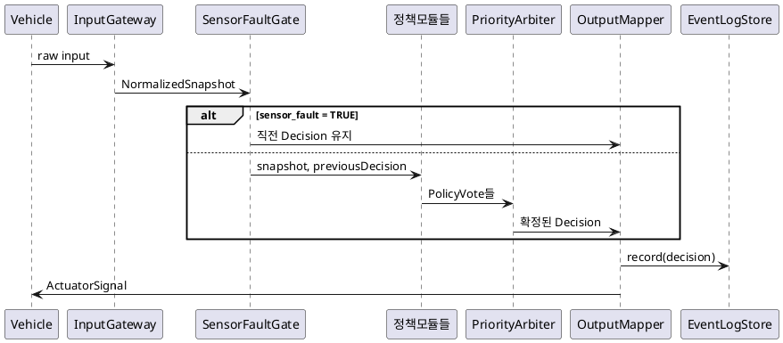

<!-- ※ 임시 형식 안내: TPL-SWE2-001과 같은 절 구조의 Markdown 초안. Python 준비 후 .docx로 전환. -->

# ENG-SWE2-001_SW 아키텍처 설계서

| 항목 | 내용 |
|---|---|
| 템플릿 ID | TPL-SWE2-001 |
| 적용 프로세스 | SWE.2 |
| 프로젝트 | VJ-ECL-2026 |
| 입력 | `ENG-SWE1-001_SW 요구사항 명세서`, `ENG-SWE1-002_Use Case 명세서` |
| 버전 | v0.1 (초안, BL-SWA-1.0 목표) |
| 작성자 | `architecture-designer` (Claude Code) |

## 1. 목적 및 적용범위

### 1.1 목적

`ENG-SWE1-001`의 SW 요구사항(SWR-001~021)을 만족하는 소프트웨어 아키텍처를 수립한다.

### 1.2 적용범위

전자식 차일드락 제어 SW 전체(입력검증부터 출력/이벤트로그까지). 실행 환경 Python 3.14, PC/SIL.

### 1.3 적용 경계

도어 래치 물리 구동, CAN/LIN 드라이버 자체의 내부 구현은 범위 밖이다(OEM-IF-005는 PC/SIL 논리 출력까지만).

## 2. 아키텍처 설계 원칙

- **계층형 구조(선택됨)**: 입력 계층 → 판단 계층 → 출력 계층. 계층 간 의존은 위→아래 단방향만 허용한다(하위 계층은 상위 계층을 모른다).
- **판단 계층 내부의 응집력 확보**: "판단 계층 하나에 모든 결정소스 로직이 몰리는" 위험을 피하기 위해, 판단 계층 내부를 결정소스별 **정책 모듈**로 분해한다. 각 정책 모듈은 SOLID 단일책임원칙을 따르며 하나의 SWR 그룹만 담당한다.
- **결합도**: 정책 모듈 간에는 서로를 호출하지 않는다(결합 없음). 모든 정책 모듈은 `IPolicyEvaluator` 인터페이스로만 `PriorityArbiter`와 통신한다(데이터 결합).
- **개방-폐쇄 원칙**: 새 결정소스가 추가되면 새 정책 모듈을 추가하고 `PriorityArbiter`의 우선순위 표에 등록하는 것으로 확장한다. 기존 정책 모듈 코드는 수정하지 않는다.
- **ASIL 분리(간섭으로부터의 자유)**: ASIL B 정책(크래시, 접근위험, sensor_fault 게이트, DEGRADED)과 QM 정책(화재/과온/성인탑승, ISOFIX, ignition-off, 운전자명령, 자동잠금)이 공존한다. QM 정책의 오류가 ASIL B 판정을 덮어쓰지 못하도록:
  - `PriorityArbiter`는 우선순위가 높은 vote부터 확정하고, 확정되면 낮은 우선순위 vote는 애초에 적용하지 않는다(우선순위 자체가 간섭 차단 메커니즘).
  - 모든 정책 모듈은 순수 함수(부작용 없음, 입력→출력만)로 구현해 다른 모듈의 상태를 변경할 수 없게 한다.

## 3. 논리 아키텍처

### 3.1 아키텍처 요소

| 계층 | 요소 | 책임 | 관련 SWR |
|---|---|---|---|
| 입력 | `InputGateway` | Vehicle/Driver 원시 입력의 형식·범위·freshness 검증, `NormalizedSnapshot`으로 정규화 | SWR-013 |
| 판단 | `SensorFaultGate` | `sensor_fault=TRUE`이면 이후 정책 평가를 건너뛰고 직전 확정 출력을 유지시키는 게이트 | SWR-021 |
| 판단 | `CrashReleasePolicy` | crash_status 기반 최우선 해제 판정 | SWR-007, 008 |
| 판단 | `ForcedReleasePolicy` | 화재/과온/성인탑승 강제 해제 판정 | SWR-017 |
| 판단 | `ApproachRiskPolicy` | 접근위험 잠금·억제·override 판정 | SWR-005, 006, 009 |
| 판단 | `IsofixLockPolicy` | ISOFIX 강제 잠금 판정 | SWR-018 |
| 판단 | `IgnitionOffPolicy` | ignition-off 해제 판정 | SWR-020 |
| 판단 | `AutoLockPolicy` | 주행 중 자동 잠금 판정 | SWR-003 |
| 판단 | `DriverCommandPolicy` | 4경로 운전자 명령 판정(좌/우/전체) | SWR-001, 002, 004 |
| 판단 | `PriorityArbiter` | 위 정책들의 `PolicyVote`를 우선순위표(8절)로 중재해 도어별 최종 `Decision` 확정 | 전체 |
| 판단 | `DegradedStateManager` | 필수 입력 stale 감지 → DEGRADED 상태 전이 | SWR-013 |
| 출력 | `OutputMapper` | `Decision`을 Actuator/Display 신호로 변환 | SWR-014, 015 |
| 출력 | `EventLogStore` | 최근 100건 결정 이벤트를 메모리에 보존 | SWR-010, 011, 012 |

### 3.2 관계와 제약

- 허용된 의존 방향: `InputGateway → (모든 정책모듈, DegradedStateManager, SensorFaultGate) → PriorityArbiter → (OutputMapper, EventLogStore)`.
- 정책모듈 사이에는 어떤 의존도 허용하지 않는다(순환 의존 원천 차단).
- `SensorFaultGate`는 다른 정책모듈보다 먼저 평가되어, TRUE면 나머지 정책 평가 자체를 생략시킨다(3단계 판정 게이트).

## 4. 컴포넌트 책임

각 정책 모듈은 `evaluate(snapshot, previousDecision) -> PolicyVote | None`만 노출한다(4단계 필수 인터페이스, 6절 참고). `PolicyVote`는 `{door, action(LOCK/RELEASE), reasonCode, sourceAsil}`을 담는다. 정책 모듈은 자신이 관여하지 않는 도어에 대해서는 `None`(투표 없음)을 반환한다.

## 5. 정적 의존성

순환 의존 없음(3.2절). 정책모듈 8개는 서로 완전히 독립적이며, 각각 별도 소스 파일로 구현한다(Phase별 구현과 1:1 대응, 12절 참고).

## 6. 인터페이스 명세

### 6.1 내부 인터페이스

| 인터페이스 | 제공자 | 사용자 | 연산 | 사전조건 | 사후조건 |
|---|---|---|---|---|---|
| `IInputGateway` | InputGateway | 판단 계층 | `normalize(rawVehicle, rawDriver) -> NormalizedSnapshot` | 없음 | 반환값의 모든 필드에 유효성 플래그 포함 |
| `IPolicyEvaluator` | 8개 정책모듈 각각 | PriorityArbiter | `evaluate(snapshot, previousDecision) -> PolicyVote \| None` | snapshot이 유효(INVALID 아님) | 관여하지 않는 도어는 None |
| `IPriorityArbiter` | PriorityArbiter | 출력 계층 | `resolve(votes: list[PolicyVote], previousDecision) -> Decision` | votes가 8절 우선순위표의 소스에서만 옴 | 도어별 정확히 하나의 action 확정 |
| `ISensorFaultGate` | SensorFaultGate | PriorityArbiter(호출 순서상 최상위) | `shouldHoldLastOutput(snapshot) -> bool` | 없음 | sensor_fault=TRUE 첫 주기에 true |
| `IOutputMapper` | OutputMapper | 출력 어댑터 | `toActuatorSignal(decision)`, `toDisplayPayload(decision)` | decision 확정됨 | OEM-IF-005/006 스키마 준수 |
| `IEventLogStore` | EventLogStore | OutputMapper, Display | `record(decision)`, `recent(n=100)` | 없음 | 최근 100건만 보존, PII/영상/음성 없음 |

### 6.2 외부 인터페이스

`ENG-SWE1-001` 6절의 OEM-IF-001~009를 그대로 계승한다. `InputGateway`가 이 외부 인터페이스들의 유일한 수신 지점이다.

## 7. 동적 동작

평가주기마다 다음 순서로 실행된다(순수 함수 파이프라인, 결정론 보장 — SWR-016).

## 8. 상태 전이 및 우선순위 정책 의사결정표 (초안 — 요구사항 8절 가정 A-1 해결)

**주의: 이 표는 초안이며 사용자 리뷰가 필요하다.** OEM 문서가 크래시 해제만 "다른 명령보다 우선"이라고 명시했고 나머지 6개 소스 간 상충 규칙은 없었다(가정 A-1). 아래는 안전(ASIL B) > 강제(생명안전 QM) > 강제(구속장치 QM) > 상태전환(QM) > 일반명령(QM) 원칙으로 도출한 초안이다.

| 우선순위 | 소스 | SWR | action | 비고 |
|---|---|---|---|---|
| P0(게이트) | SensorFaultGate | SWR-021 | 직전 출력 유지 | TRUE면 아래 전부 평가 안 함 |
| P1 | CrashReleasePolicy | SWR-007/008 | RELEASE | crash_status=CONFIRMED만. PENDING은 무동작(가정 A-2) |
| P2 | ForcedReleasePolicy | SWR-017 | RELEASE | 화재/과온/성인탑승 |
| P3 | ApproachRiskPolicy | SWR-005/006/009 | LOCK(또는 override 시 RELEASE) | override는 10초 이내 재입력 조건(SWR-006) |
| P4 | IsofixLockPolicy | SWR-018 | LOCK | |
| P5 | IgnitionOffPolicy | SWR-020 | RELEASE | |
| P6 | AutoLockPolicy | SWR-003 | LOCK | |
| P7 | DriverCommandPolicy | SWR-001/002/004 | LOCK/RELEASE | 가장 낮은 우선순위(다른 정책이 관여 안 할 때만 적용) |

**해석 규칙**: 도어별로 P0부터 순서대로 검사해, 해당 소스가 vote를 내면(None이 아니면) 그 vote로 확정하고 이후 낮은 우선순위는 평가하지 않는다. 동시에 여러 낮은 우선순위 vote가 있어도 가장 높은 것 하나만 채택한다.

## 9. 오류 격리와 안전 동작

- `SensorFaultGate`가 다른 모든 정책보다 먼저 평가되어, 센서 결함 시 잘못된 정책 평가 자체를 원천 차단한다.
- `InputGateway`에서 거절된(INVALID) 필드는 해당 필드를 사용하는 정책모듈에 "판단 불가"로 전달되어, 그 정책은 vote를 내지 않는다(None).
- ASIL B 정책(P0~P3)이 QM 정책(P4~P7)보다 항상 먼저 확정되므로, QM 로직의 결함이 안전 판정을 덮어쓸 수 없다.

## 10. 품질속성 분석

| 품질속성 | 분석 |
|---|---|
| 성능효율성 | 정책모듈 8개 + Arbiter가 매 평가주기 순차 실행. 각 모듈은 O(1) 판정이므로 SWR-007의 300ms 제약을 넉넉히 만족할 것으로 예상(구현 후 실측 필요). |
| 신뢰성 | SensorFaultGate·DEGRADED 처리로 입력 결함에 대한 회복력 확보. |
| 유지보수성 | 정책모듈이 서로 독립적이라 하나를 수정해도 다른 모듈에 영향 없음(회귀 범위 최소화). |

## 11. 통합 전략

의존관계 기반 통합 순서(architecture-designer 스킬 `references/integration-order.md` 적용).

| 단계 | 통합 대상 | 전제조건 | 대응 Phase |
|---|---|---|---|
| 1 | `InputGateway`, `DegradedStateManager`, `SensorFaultGate` | 없음(최하위) | Phase 1 |
| 2 | `CrashReleasePolicy`, `ApproachRiskPolicy` | 1단계 완료 | Phase 2 |
| 3 | `ForcedReleasePolicy`, `IsofixLockPolicy`, `IgnitionOffPolicy` | 1단계 완료(2단계와 병렬 가능) | Phase 3 |
| 4 | `DriverCommandPolicy`, `AutoLockPolicy` | 1단계 완료(2,3단계와 병렬 가능) | Phase 4 |
| 5 | `PriorityArbiter`, `OutputMapper`, `EventLogStore`, 전체 통합 | 2~4단계 완료 | Phase 5 |

## 12. 요구사항 할당

`ENG-SWE1-001`의 각 SWR은 3.1절 표의 "관련 SWR" 열대로 아키텍처 요소에 할당되었다. 누락 확인: SWR-001~021(019 예비) 전부 정확히 하나 이상의 요소에 할당됨을 확인했다.

## 13. 자원 및 배포 경계

단일 Python 3.14 프로세스, 메모리 내 상태만 사용(영속 저장소 없음, SWR-012). PC/SIL 환경이므로 실시간 OS 스케줄링 제약은 다루지 않는다.

## 14. 추적성

`ENG-TRC-001`을 이 아키텍처 요소 매핑으로 갱신한다(별도 커밋에서 반영).

## 15. 참고자료

`ENG-SWE1-001`, `ENG-SWE1-002`, `.claude/skills/architecture-designer/`, `.claude/skills/detailed-designer/references/iso26262-swe3-constraints.md`(다음 Phase에서 사용)
